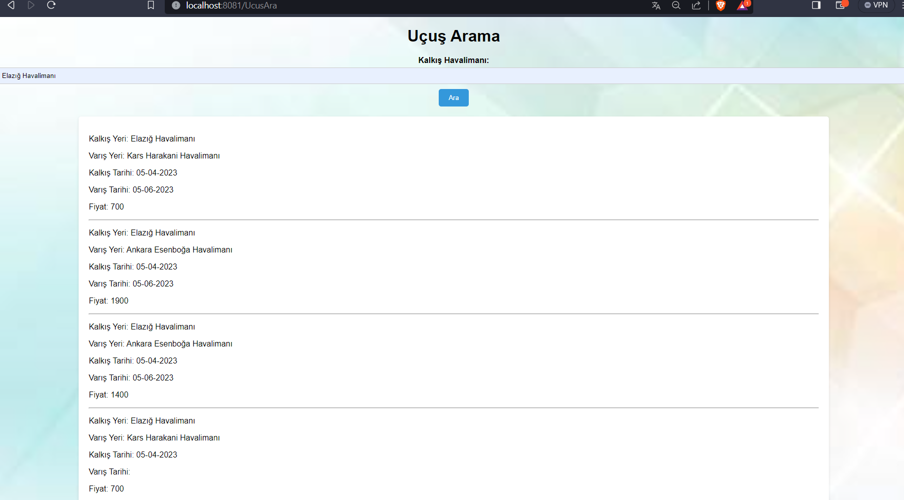

<h1> Flight Reservation System with SpringBoot</h1>

<h2> Usaged Tecnology </h2>
<ul>
    <li>SpringBoot Version : 2.6.2  </li>
    <li>Java Version : 17  </li>

</ul>
<h3>Dependencies</h3>
<ul> 
    <li>Thymeleaf  </li>
    <li> Data JPA </li>
    <li> Web </li>
    <li> DevTools </li>
    <li> Lombok </li>
    <li> Security </li>
    <li> MySQL Connector / J </li>

</ul>

<h3> Main Page </h3>

<h3> All Flights </h3>

<h3> Flight Search  </h3>

<h3> Flight Search  </h3>

<h3> Admin Panel Login Page  </h3>

<h3> Admin Panel   </h3>

<h3> My Database (DataGrip IDE)   </h3>

